# 📦 CRUD Data Management - Tugas Praktikum

## 📸 Hasil Screenshot

Berikut adalah hasil implementasi file CRUD yang telah dibuat:
### 🔹 SEARCH
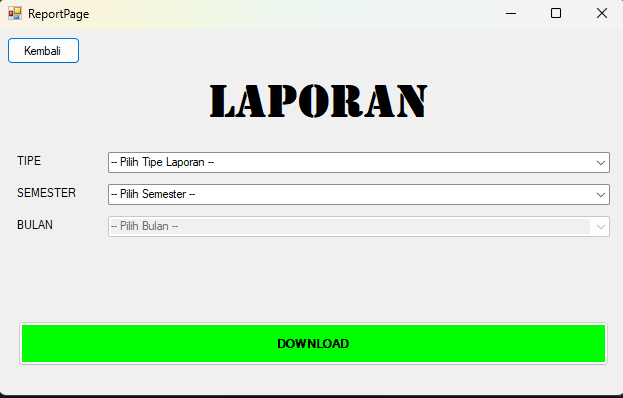
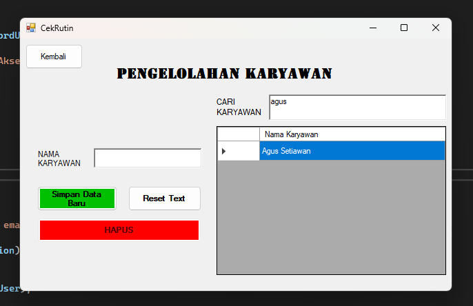
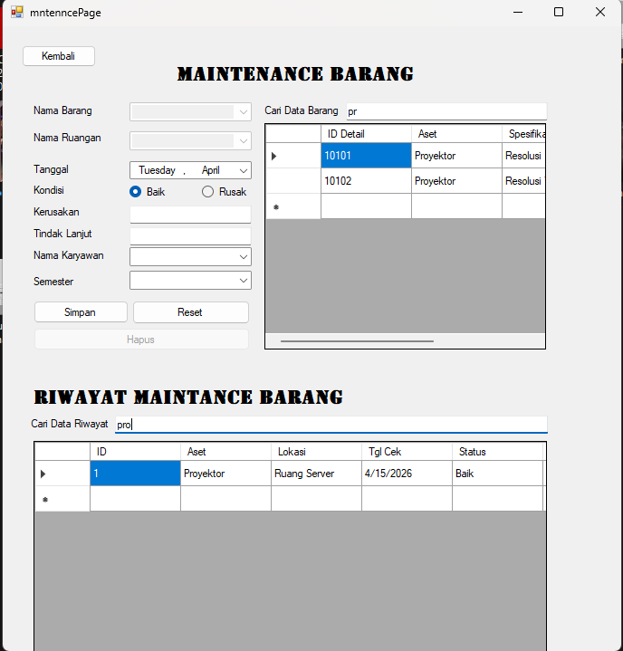
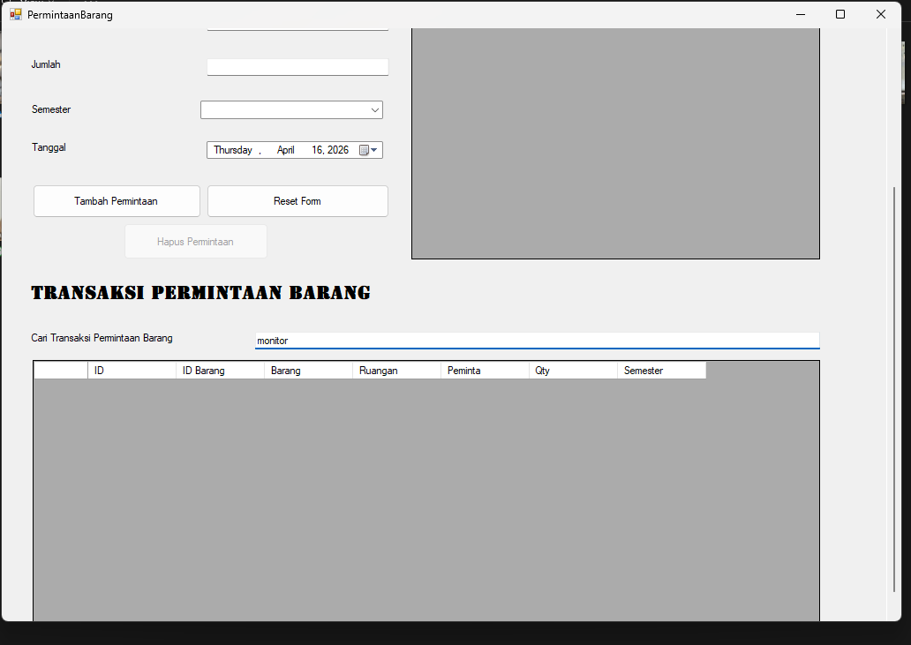
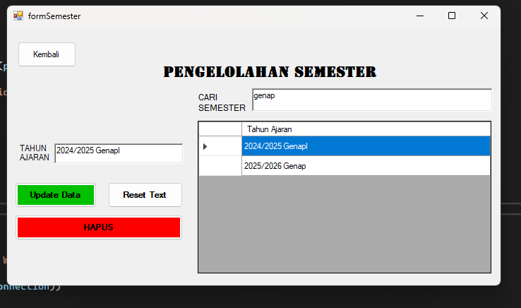
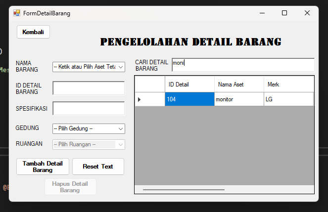

### 🔹 INSERT
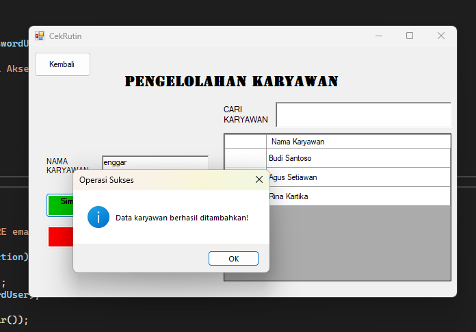
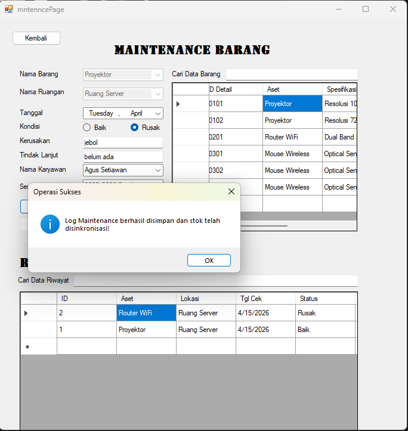
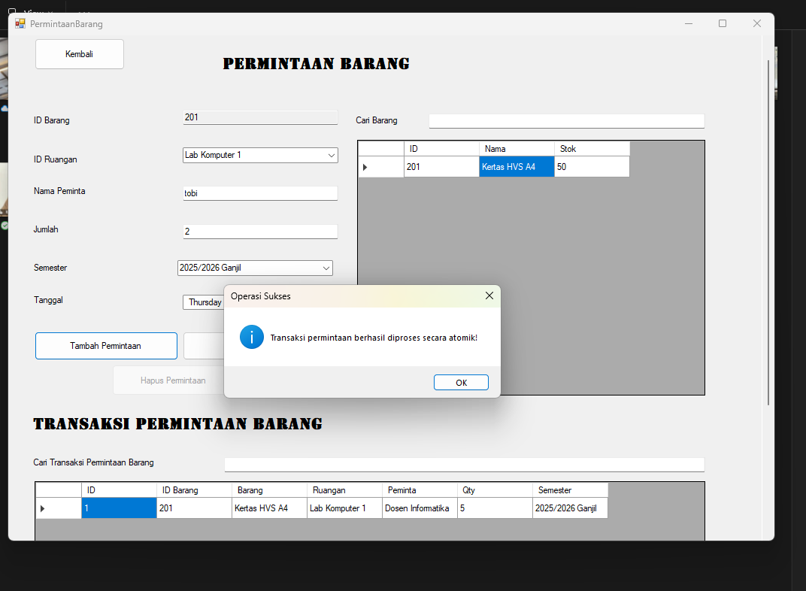
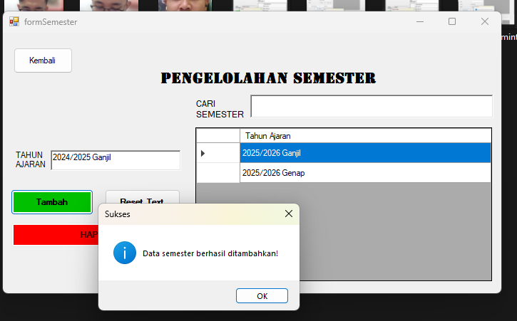
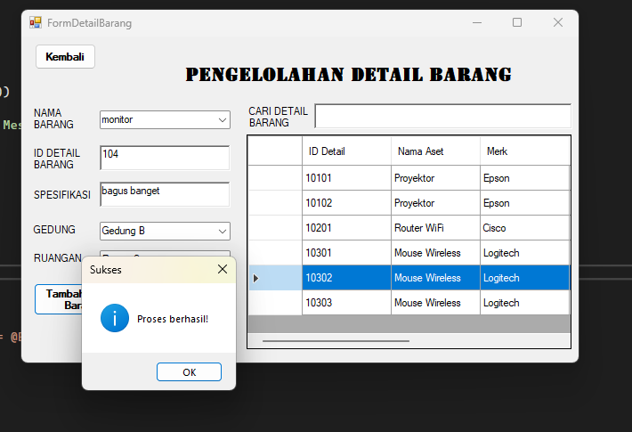
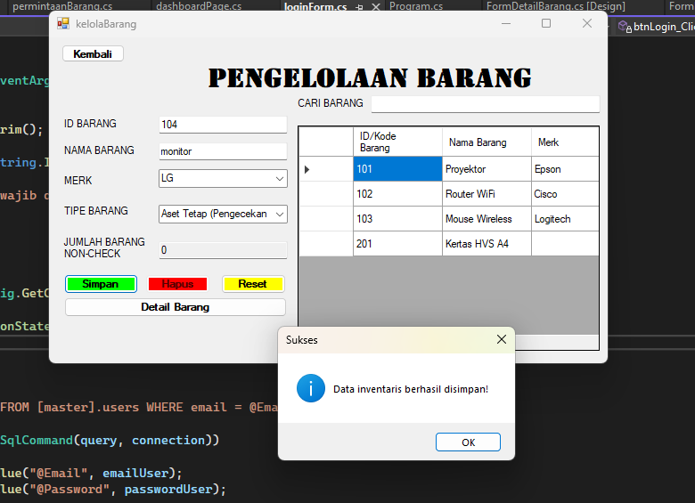

### 🔹 UPDATE
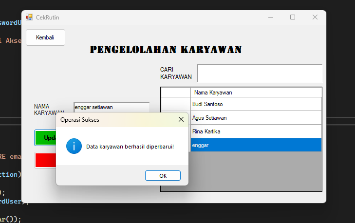
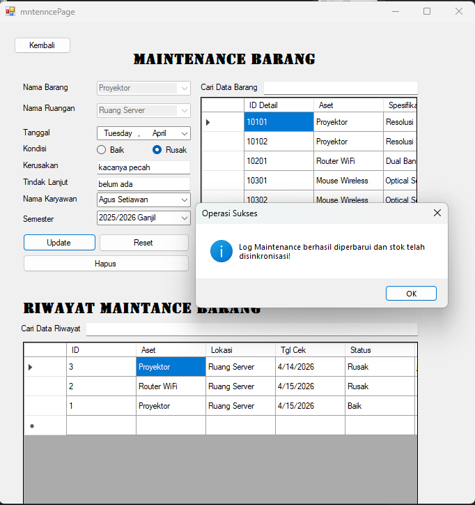
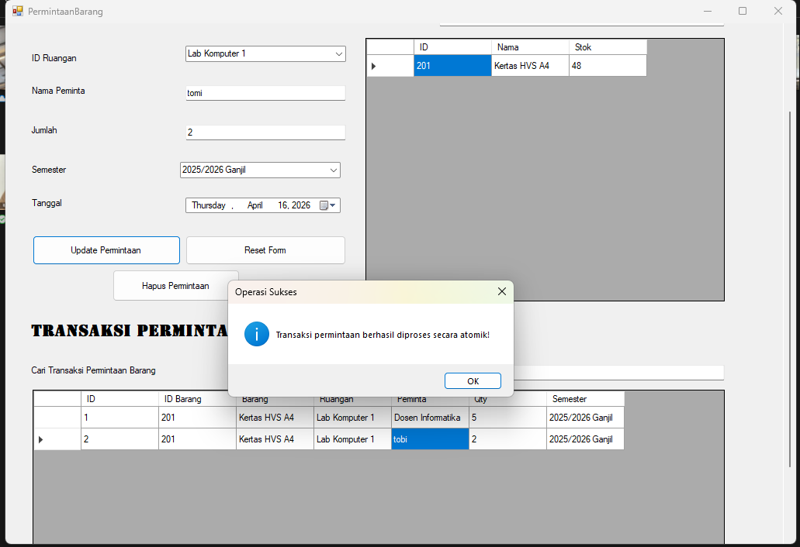
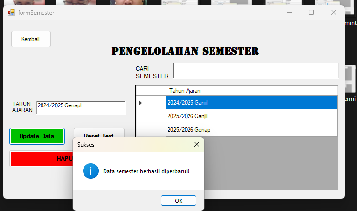
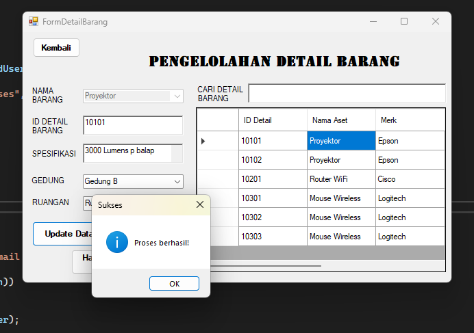

### 🔹 DELETE
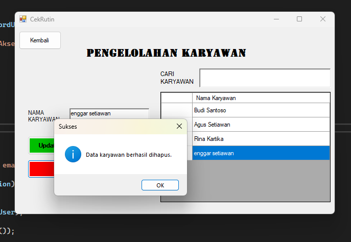
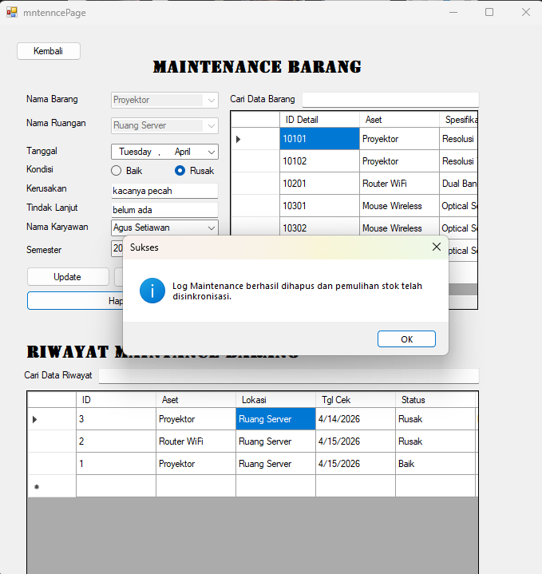
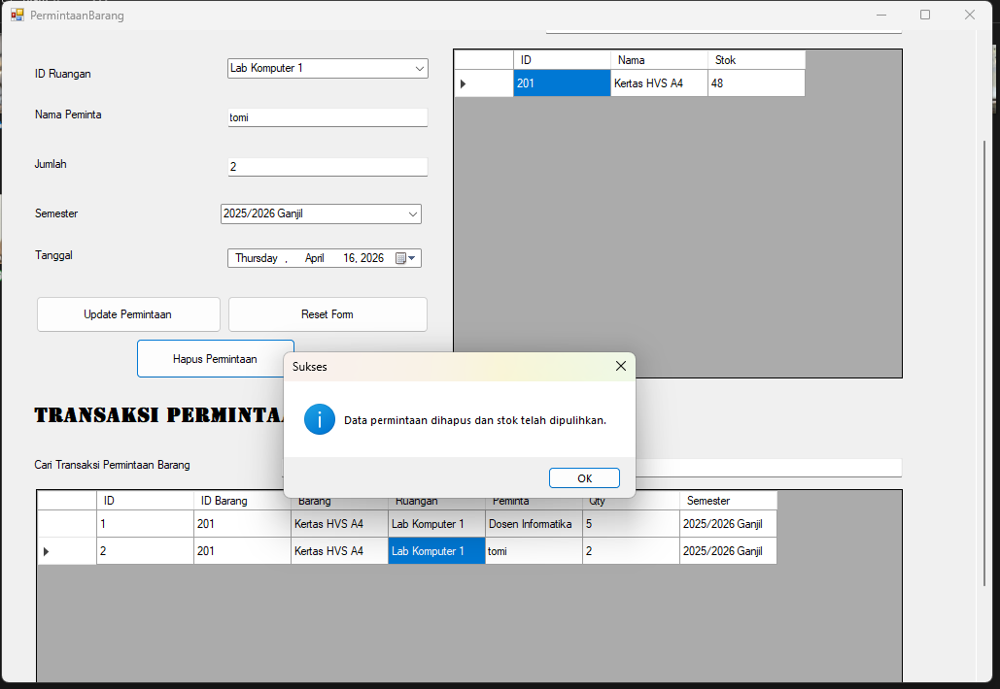
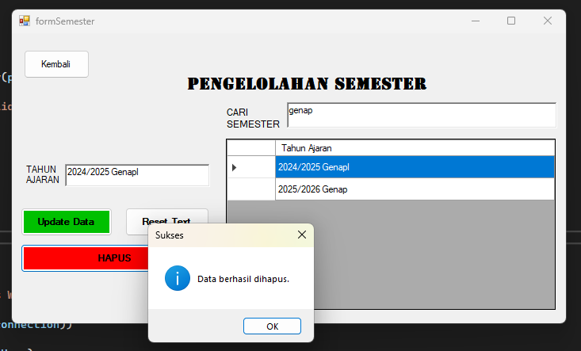
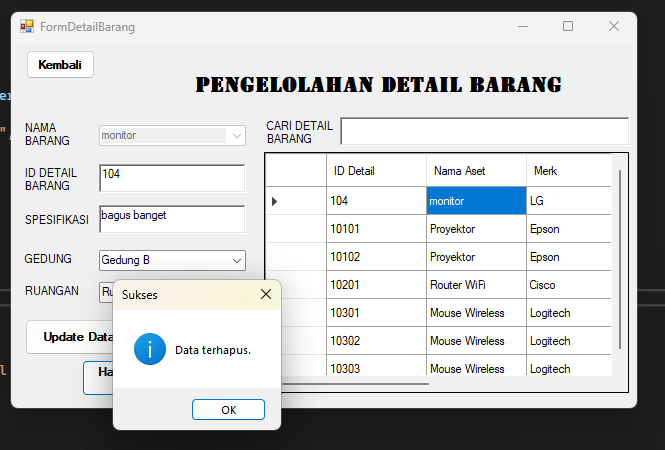
